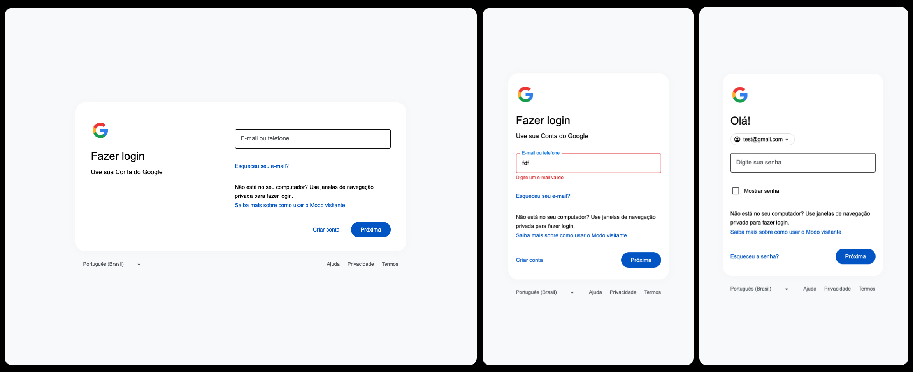

# Clone Sign Pages

This project aims to recreate a pixel-perfect clone of the Google Sign page for educational purposes. The implementation is designed to be lightweight and compatible with ESP32 devices.

## Repository Overview

The "clone-pages" repository contains multiple clones of popular web pages, including (but not limited to):

- Google Sign Page
- Facebook (coming soon)
- Twitter (coming soon)
- Apple (coming soon)
- Microsoft (coming soon)
- Instagram (coming soon)

Each clone is created using pure HTML, CSS, and JavaScript, optimized for learning and potential use on devices with limited resources like the ESP32.

## Technologies Used

- HTML
- CSS
- JavaScript

## Purpose

This project serves multiple purposes:

1. To create lightweight, functional web interfaces for devices with limited resources (e.g., ESP32)
2. To provide a learning resource for other developers interested in web cloning techniques

## Implementation Details

- **Pure HTML/CSS/JavaScript**: No external libraries or frameworks are used to keep the codebase minimal and efficient.
- **Responsive Design**: Each page adapts to different screen sizes, ensuring a consistent user experience across devices.
- **Error Validation**: Basic client-side validation is implemented where applicable.
- **Size Optimization**: Each clone is kept under 20,000 characters to meet ESP32 limitations.

## Disclaimer

This project is for educational purposes only. The cloned pages are not intended for production use and should not be used to mislead users or infringe on any copyrights. Always respect the terms of service of the websites you're cloning.

## License

This project is open source and available under the [MIT License](LICENSE).
